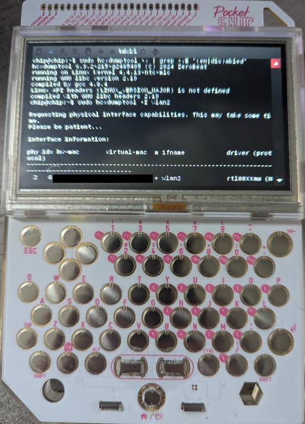
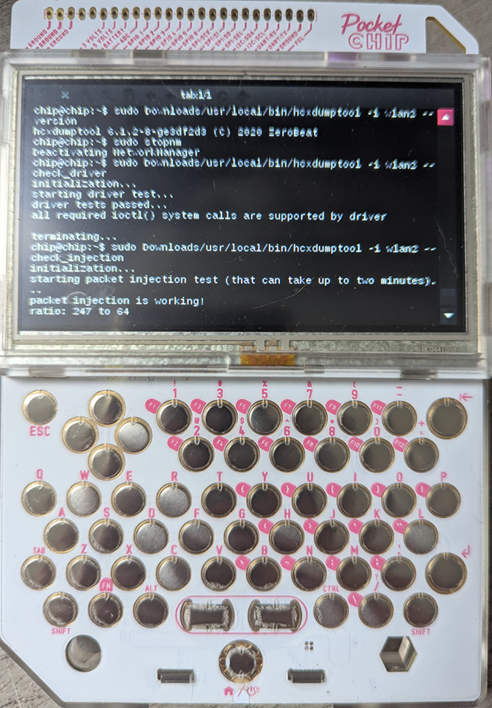

# PocketCHIP hcx (hcxdumptool and hcxtools)

Instructions for installing (outdated versions of) hcxdumptool and hcxtools on the [PocketCHIP](https://en.wikipedia.org/wiki/CHIP_(computer)#Pocket_CHIP_and_Pockulus) device originally manufactured by Next Thing Co. Limited usage instructions for hcxdumptool are also included. Finally, building instructions for advanced users who prefer to build their own software and driver (rather than use the precompiled ones included in [Releases](https://github.com/Bort-Millipede/PocketCHIP_hcx/releases)) will be included at a later date.

While the information included here could easily be used for other renditions of the CHIP computer, the PocketCHIP is specifically targeted due to the portable nature of the device.

## Disclaimer

The author provides all information for free without warranty, and assumes no responsibility for any damage caused to any systems by leveraging the information. It is the responsibility of the reader to abide by all local, state and federal laws while digesting and using the information.

Digest and use this at your own risk!!!

### Per the hcxdumptool/hcxtools Developer

hcxdumptool/hcxtools is NOT recommended to be used by inexperienced users or newbies. The entire toolkit (hcxdumptool and hcxtools) is designed to be an analysis toolkit.

## Requirements

* PocketCHIP device (obviously)
* [Archer T2U Nano](https://www.tp-link.com/us/home-networking/usb-adapter/archer-t2u-nano/) USB Wireless adapter (Amazon link available on product page)

### Linux Kernel Version

These instructions assume that Linux kernel version `4.4.13-ntc-mlc` is in use on the PocketCHIP device. Unfortunately, the Linux operating system on PocketCHIP does not appear to support force-loading kernel modules compiled for kernel modules not matching the running kernel version.

To ensure the recommended kernel is in use, the PocketCHIP device can be freshly flashed with the `stable-pocketchip-b126` image available [HERE](https://archive.org/details/C.h.i.p.FlashCollection). This is recommended by the author but is ultimately not required if the PocketCHIP is already running the required kernel version.

The building instructions could be easily adapted to support other kernel versions, but this will be done at one's own risk. The author will consider adding support for other kernel versions if sufficient interest is expressed.

### Why is a USB adapter required?

The PocketCHIP contains two built-in wireless adapters. However, these cannot/should not be used with hcxdumptool because:
1. The adapters cannot seem to be put into a Monitor mode in a way that hcxdumptool recognizes
2. The stock drivers may not support injection (required by hcxdumptool)
3. The adapters only support 2.4GHz signals

While the first and second points could likely be resolved by using either a different device driver or a custom-compiled device driver, the author does not consider this to be worth researching/evaluating.

The Archer T2U Nano device is recommended for the following reasons:
* Very small device
* Inexpensive
* Easy setup
* Uses a recommended chipset (RTL8812AU)
* Supports 2.4GHz and 5GHz

Other adapters using the RTL8812AU chipset should also work with these instructions, but the author has only tested this with the Archer T2U Nano device and therefore makes no guarantees.

## Choosing Preferred Software Versions

### hcxdumptool

The latest version of hcxdumptool does not build successfully for the PocketCHIP device. Version 6.3.2 ([this commit](https://github.com/ZerBea/hcxdumptool/tree/24854050272c03d83e99ccd7d257f4d0db1bbf2b) from February 2024) or Version 6.1.2 ([this commit](https://github.com/ZerBea/hcxdumptool/tree/e3df2d34689069522088331800a3c38b6b11ccd8) from September 2020) can be installed and run on the PocketCHIP device. Which version is best for the user is up to their discretion. Some things to consider:
* **6.3.2:** Much newer version with countless improvements and bugfixes, but not containing certain past troubleshooting functionality (such as `--check_driver` and `--check_injection`).
* **6.1.2:** Older version without newer features/functionality, but containing troubleshooting functionality (`--check_driver` and `--check_injection`).

Alternatively, the hcxdumptool 6.3.2 can be installed to the system and hcxdumptool 6.1.2 can be extracted to a local directly and executed directly to make use of the troubleshooting functionality if needed.

### hcxtools

hcxtools is mostly optional on the PocketCHIP altogether, but may be useful to some users nonetheless.

The latest version of hcxtools does not build successfully for the PocketCHIP device. Version 6.1.3 ([this commit](https://github.com/ZerBea/hcxtools/tree/f6695efe646cff4a8c434af9ad01059c2fb5e515) from November 2020) or Version 5.3.0 ([this commit](https://github.com/ZerBea/hcxtools/tree/52d984890f3df31ecb4333681fb2512318ada6f9) from December 2019) can be installed and run on the PocketCHIP device. Which version is best for the user is up to their discretion.

## Installation

### Software Dependencies

Dependencies can either be installed via APT (using the CHIP mirror described [HERE](http://chip.jfpossibilities.com/chip/debian/)), or by directly installing the required *.deb package files. Both methods are described below.

#### APT

The following command will install the required dependencies via APT.

```bash
sudo apt install aircrack-ng libcurl4-openssl-dev libssl-dev zlib1g-dev libc6 libc6-dev linux-libc-dev
```


#### DEB Package Files

Enter the directory (ex. ~/Downloads) where the *.deb files should be downloaded. Then execute the following command to download the files (referencing the [deb_urls.txt](deb_urls.txt) file):

```bash
for u in `cat /path/to/deb_urls.txt`; do wget -O `echo "$u" | rev | cut -d"/" -f 1 | rev` "$u"; done
```

&nbsp;  
Install all the downloaded packages with the following command:
```bash
sudo dpkg -i -E *.deb
```

**NOTE:** Some of these packages are likely already installed on Linux on PocketCHIP by default, so the above command will only install packages that are not already installed.

### Tools (hcxdumptool and hcxtools)

All files referenced below are available in [Releases](https://github.com/Bort-Millipede/PocketCHIP_hcx/releases). These files must first be copied to the PocketCHIP device. Only one version of `hcxdumptool` and `hcxtools` may be installed to the system under `/usr/local` at one time. Alternatively, the binaries may be executed from a local directory.

The following commands will install hcxdumptool 6.3.2 to the system (under `/usr/local`):

```bash
cd /
sudo tar xzpf /path/to/hcxdumptool-6.3.2-215-g2485405.pocketchip.tar.gz
```

&nbsp;  
The following commands will install hcxdumptool 6.1.2 to the system (under `/usr/local`):

```bash
cd /
sudo tar xzpf /path/to/hcxdumptool-6.1.2-8-ge3df2d3.pocketchip.tar.gz
```

&nbsp;  
The following commands will install hcxtools 6.1.3 to the system (under `/usr/local`):

```bash
cd /
sudo tar xzpf /path/to/hcxtools-6.1.3-53-gf6695ef.pocketchip.tar.gz
```

&nbsp;  
The following commands will install hcxtools 5.3.0 to the system (under `/usr/local`):

```bash
cd /
sudo tar xzpf /path/to/hcxtools-5.3.0.pocketchip.tar.gz
```

### Wireless Driver

The `88XXau_v5.6.4.2_35491.20191025_4.4.13-ntc-mlc.pocketchip.gz` file referenced below is available in [Releases](https://github.com/Bort-Millipede/PocketCHIP_hcx/releases). This file must first be copied to the PocketCHIP device.

The following commands will install the wireless driver (loadable kernel module) to the correct directory and regenerate the system's list of kernel module dependencies.

```bash
sudo mkdir -p /lib/modules/4.4.13-ntc-mlc/kernel/net/wireless
sudo sh -c "gzip -dc 88XXau_v5.6.4.2_35491.20191025_4.4.13-ntc-mlc.pocketchip.gz > /lib/modules/4.4.13-ntc-mlc/kernel/net/wireless/88XXau.ko"
sudo chmod 644 /lib/modules/4.4.13-ntc-mlc/kernel/net/wireless/88XXau.ko
sudo /sbin/depmod -a
```

## Usage

Plug the USB wireless adapter into the PocketCHIP device USB port.

Load the wireless driver (this command can be safely run even if the driver has already been loaded).

```bash
sudo modprobe 88XXau
```

&nbsp;  
After this, the wireless adapter should appear as interface `wlan2`. Confirm this with the following command (the output should start with `wlanX`, which is the interface assigned to the USB adapter).

```bash
sudo airmon-ng | grep rtl88XXau
```

&nbsp;  
hcxdumptool requires NetworkManager and wpa_supplicant to be terminated (which will also halt the wireless connection on the primary `wlan0` adapter) in order to work properly. This can be accomplished via several methods.

If using hcxdumptool 6.3.2: using the following `stopnm` command:

```bash
sudo stopnm
```

&nbsp;  
If using hcxdumptool 6.1.2: using the following `makemonnb` command (replace `wlan2` with the correct interface if the USB adapter was assigned a different interface):

```bash
sudo makemonnb wlan2
```

&nbsp;  
If using either hcxdumptool version: using the following `airmon-ng` command:

```bash
sudo airmon-ng check kill
```

&nbsp;  
hcxdumptool can then be executed (as root or via sudo) and used as normal. **Guidance on how to use hcxdumptool is not covered here and must be obtained elsewhere.**

## Restoring Wireless Connections After Usage

If the wireless connection on the `wlan0` needs to be restored without rebooting the PocketCHIP device, this can be accomplished by restarting NetworkManager and wpa_supplicant.

If using hcxdumptool 6.3.2: using the following `startnm` command:

```bash
sudo startnm
```

&nbsp;  
If using hcxdumptool 6.1.2: using the following `killmonnb` command (replace `wlan2` with the correct interface if the USB adapter was assigned a different interface):

```bash
sudo killmonnb wlan2
```

&nbsp;  
If using either hcxdumptool version: using the following generic commands:

```bash
sudo systemctl start NetworkManager
sudo systemctl start wpa_supplicant
```

## Usage Examples

  
*hcxdumptool 6.3.2 executed on PocketCHIP*

  
*hcxdumptool 6.1.2 executed on PocketCHIP*


